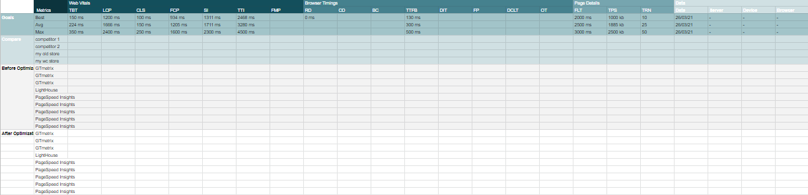

# WPM (Web Performance Metrics)

Designed Spreadsheet to help you have a clear approach to summarize, simplify & keep track of the performance analysis of your web page.

- Preset performance goals, with predefined stats.
- Account for different performance metrics.
- Flexible with multiple tools.

**Last Update: 25/10/21.**\
**[Download Link:]().**\
**Note!: Always Opened for Discussion & Improvements, Issues Report, & Pull Requests Are Welcomed.**

## Why Performance!?

Website performance measures how quickly the pages of a website load and display in the web browser. Web performance optimization is the practice of improving website performance by various methods.

- **Better User Experience (UX):** Make a good first impression. longer visits lead to lower bounce rates & more page views.
- **Search Engine Optimization (SEO):** fast websites get ranked higher by Google & can quickly climb to first positions when performing better than the competition.
- **Slow costs money, Fast Makes money:** generate bigger opportunities to gain conversion rates, leads & customers.

**Consider these stats:**

- According to Kissmetrics, 47% of consumers expect a web page to load in 2 seconds or less.
- This same study also found that 40% of people abandon websites that take more than 3 seconds to load.
- Walmart saw a 2 percent increase in conversion rates for every 1 second improvement in page load times.
- For Amazon, a slowdown of just one second of page load time cost the company $1.6 billion in sales.
- 47% of users visiting a site will abandon it if it’s not loaded within 3 seconds.
- 88% of online consumers are less likely to return to a site after a bad experience.
- 44% of online shoppers say that slow online transactions make them anxious about the success of a transaction.
- We remember wait times as being 35% longer than reality and base our satisfaction on this remembered web application performance rather than reality.
- The abandonment rate for mobile shopping carts is 97%, compared to 70–75% for desktop carts.
- The total cost of abandoned shopping carts for online retailers has been estimated at more than$18 billion per year.
- 85% of mobile users expect pages to load as fast or faster than they load on the desktop.

## The Metrics

There are various  metrics that need to be considered when ensuring your website performance.

### Inconsistent/Difrrent Results

Variability in performance measurement is introduced via a number of channels with different levels of impact. Several common sources of metric variability are local network availability, client hardware availability, and client resource contention.

- Each website speed test tool offers varying functionality and features.
- Test can vary from one server its location to another, device, OS, browser, version to another.
- Optimize Image is changing because you have a scrolling banner on your homepage & sometimes PageSpeed gets different banners in its results.
- Server Response Time is changing because your server isn't always consistent in it's response time. This is fairly common.
  
### Mobile is much important

- Consumers increasingly rely on mobile to access digital content & services.

- Mobile experince is fairly limited compared to desktop. as it doesnt  offer same resources(CPU, GPU and RAM), beside  lower access to network speed,  that we are used to while using desktop. yet users expect faster experince then desktop.

## Approach

- If you can afford monitoring would be great.
- Add some compare to pages (eg: diffrent page, old page, competitor page, ...).
- Analyze Before Optimzation.
- Use Diffrent Tools.
- Run Multiple Tests on diffrent Times.
- Run from Different Geographic Locations/ diffrent devices & browsers, to simulate a variety of end-users.
- Use Tools Suggestions & best practices to improve your performance then run your test again.
- Focus on these impactful metrics first before undertaking deeper optimizations.
- Priortize mobile devices.
- Consider that 1st visit can slower then 2nd visit, if some practices like caching are used.

### Example of WPM SpreadSheet

**[Download Link:]().**
___

## Best Practices Checklist

- [x] CDN (Content Delivery Network).
- [ ] Server-side caching (Cache Policy)
- [ ] Server-side caching
- [ ] Choose Right Server Architecture / Hosting.
- [ ] AMP.
- [ ] PWA.
- [ ] lazy load images.
- [ ] Preload & Prefetch. Use prefetching techniques
- [ ] Async & Defer
- [ ] Implement Gzip Compression.
- [ ] serve images in next gen format. WebP.
- [ ] compress images.
- [ ] resize images.
- [ ] remove unused css.
- [ ] remove unused js.
- [ ] minfy html
- [ ] minfy js
- [ ] minfiy css
- [ ] avoid unecessary dom.
- [ ] use css splits
- [ ] reduce number of requests.
- [ ] Avoid direct embed of videos.
- [ ] Appearance of a Fluid Experience: Google research suggests that web applications deliver page load times of less than 100 milliseconds, which is the how long the Occipital lobe, or “memory store,” of the brain stores information as a sensory memory.
- [ ] Progress Notice: in case of 
- [ ] Reduce the number of plugins
- [ ] Implement Gzip Compression | Pro tip: pre-compress the assets and configure the server to send those instead of using the raw version. If you can’t use Brotli for whatever reason, pre-compress gzip, too.
- [ ] Font delivery optimization: The font-display property
- [ ] Database optimization in CMS
- [ ] Optimize API Database Requests (N+1, ...)
- [ ] Reduce the use of web fonts.
- [ ] Reduce redirects
- [ ] Stop using img tags, use picture tag instead.
- [ ] Server-side tracking instead of client-side.
- [ ] Use web workers to move processing off the main thread.
- [ ] Inline Critical CSS at scale:
- [ ] Use CSS Sprites.
- [ ] Keep Your Site Lean
  
### Tools

  - [Google PageSpeed Insights](https://developers.google.com/speed/pagespeed/insights/)
  - [Web Page Test](https://www.webpagetest.org/)
  - [GT Metrix](https://gtmetrix.com/)
  - [Pingdom Speed Test](https://tools.pingdom.com/)
  - [LightHouse](https://developers.google.com/web/tools/lighthouse)
  - [KeyCDN Speed Test](https://tools.keycdn.com/speed)
  - [Yellow Lab Tools](https://yellowlab.tools/)
  - [Pagelocity](https://pagelocity.com/)
  - [Uptime](https://uptime.com/freetools/website-speed-test)
  - [Isitwp tool](https://www.isitwp.com/free-website-speed-test-tool-for-wordpress/)
  - [Uptrends](https://www.uptrends.com/tools/free-mobile-website-speed-test)
  - [SpeedCurve](https://app.speedcurve.com/)
  - [Bytecheck](https://www.bytecheck.com/)
  - [Dotcom-monitor](https://www.dotcom-tools.com/website-speed-test)
  - [Site24x7](https://www.site24x7.com/)
  - [K6](https://k6.io/)
  - [New Relic](https://newrelic.com/)
  - [DebugBear](https://www.debugbear.com/)
  - [Calibreapp](https://calibreapp.com/)
  - [Cloudinary](https://webspeedtest.cloudinary.com/)
  - [CrUX](https://developers.google.com/web/updates/2018/08/chrome-ux-report-dashboard) 
  
### Abbreviations

- TBT (Total Blocking Time).
- LCP (largest Contentfull paint) .
- CLS (Cumulative Layout Shift) .
- FCP (first Contentfull paint) .
- SI (Speed Index) .
- TTI (Time to Interactive)
- FMP (First Meaningful Paint).
- RD (Redirect Duration) .
- CD (Connection Duration) .
- BC (Backend Duration) .
- TTFB (Time to First Byte) .
- DIT (DOM Interactive Time)
- FP (First Paint) .
- DCLT (DOM Content Loaded Time) .
- OT (Onload Time) .
- FLT (Fully Loaded Time) .
- TPS (Total Page Size) .
- TRN (Total  Requests Number).
  
### Rethinking Whats Next:

- Add Best Practices Checklist. 

- Disscuss Issues, & suggest Improvments.  

- Write functions for google sheet to automaticly detect score & compare metrics values.
  
- A tool that automate page perfromance testing (via diffrent tools API). & fill up the Spreadsheet for us.

### Sources

- https://achievion.com/blog/web-application-speed-why-performance-matters.html
- https://ahrefs.com/blog/advanced-pagespeed-guide/
- https://backlinko.com/page-speed-stats
- https://blog.hubspot.com/marketing/reducing-page-size
- https://blog.hubspot.com/website/website-performance
- https://developer.mozilla.org/en-US/docs/Learn/Performance
- https://developers.google.com/speed/docs/insights/v5/about
- https://groups.google.com/g/pagespeed-insights-discuss/c/9IvH8oQXuQ4
- https://gtmetrix.com/
- https://kinsta.com/blog/ttfb/
- https://kinsta.com/blog/website-speed-test/
- https://loadninja.com/articles/3-ways-to-improve-your-web-app-speed/
- https://loadninja.com/articles/google-pagespeed-insights/
- https://mentormate.medium.com/how-to-ensure-your-web-app-performance-stacks-up-f5650e218dfb
- https://onix-systems.com/blog/how-web-application-performance-testing-benefits-your-business
- https://reddit.com/r/webdev/comments/f9a77b/speed_test_results_inconsistent/
- https://rockcontent.com/blog/pagespeed-tools/
- https://sematext.com/blog/website-performance-speed-test-tools/
- https://siamcomputing.com/general/importance-performance-optimization-website/
- https://speedy.site/average-page-load-times-for-2020/
- https://speedy.site/average-page-load-times-websites-2018/
- https://stackoverflow.com/questions/30875915/google-pagespeed-insights-inconsistent-result
- https://support.google.com/webmasters/thread/110900300/web-vitals-library-cls-results-are-inconsistent-with-pageinsights-results?hl=en
- https://web.dev/
- https://web.dev/why-speed-matters/
- https://wp-rocket.me/blog/best-practice-guide-reducing-website-page-weight/
- https://wp-rocket.me/blog/the-truth-about-google-pagespeed-insights/
- https://www.altexsoft.com/blog/engineering/12-techniques-of-website-speed-optimization-performance-testing-and-improvement-practices/
- https://www.loadview-testing.com/website-speed-test/
- https://www.pingdom.com/
- https://www.pingdom.com/blog/webpages-are-getting-larger-every-year-and-heres-why-it-matters/
- https://www.stxnext.com/blog/web-app-speed-website-performance/
- https://www.thinkwithgoogle.com/marketing-strategies/app-and-mobile/mobile-page-speed-new-industry-benchmarks/
- https://www.titangrowth.com/blog/reduce-http-requests-like-a-pro-120/